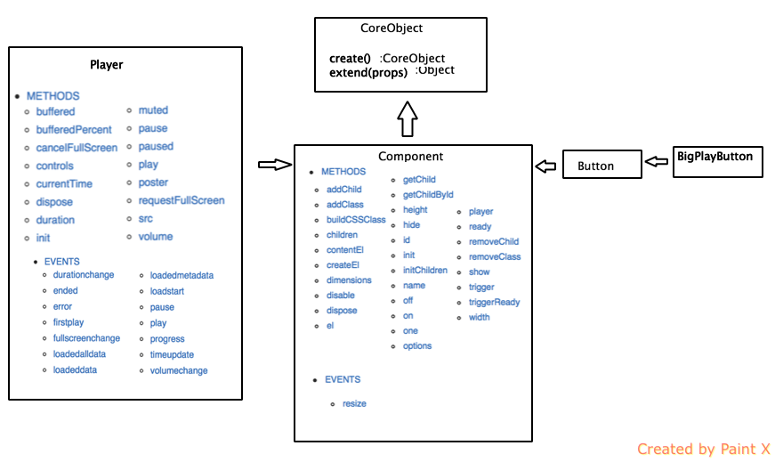

##On Video.js

##How it is set-up##

##All Classes##
* Util
* JSON
* Core
* CoreObject
  * Components
    * Player
    * Button
        * MenuButton
            * VolumeMenuButton
            * TextTrackButton
                * SubtitleButton
                * CaptionsButton
                * ChaptersButton
            * PosterImage
            * FullScreenToggle
            * PlayToggle
            * MuteToggle
    * MediaLoader
    * Menu
    * MenuItem
        * ChaptersTrackMenuItem
        * TextTrackMenuItem
            * OffTextTrackMenuItem
    * MediaTechController
        * Flash
        * HTML5
    * PlayProgressBar
    * ProgressControl
    * Slider
        * SeekBar
        * VolumeBar
    * SliderHandle
        * SeekHandle
        * VolumeHandle
    * ControlBar
    * LoadProgressBar
    * CurrentTimeDisplay
    * RunnningTimeDisplay
    * DurationDisplay
    * LoadingSpinner
    * TextTrack
        * ChaptersTrack
        * SubtitlesTrack
        * CaptionsTrack
    * TextTrackDisplay
    * TimeDivider
  
    * VolumeControl
  * VolumeLevel

